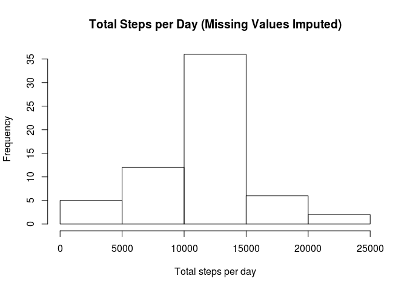

# Reproducible Research: Peer Assessment 1


## Loading the data
***

The data was downloaded from [this link](https://d396qusza40orc.cloudfront.net/repdata%2Fdata%2Factivity.zip)
provided in the assignment. The data in the file is described in the README.md 
document. Briefly, there are three columns in the CSV named 'steps', 'date', and 
'interval'. The read.csv function, along with specified colClasses, can be used
to read the data into R. The package data.table is also used to turn the data
frame into a data.table for easier manipulation.


```r
activity <- read.csv(unz('activity.zip', 'activity.csv'), 
                     colClasses = c('numeric', 'Date', 'numeric'))
library(data.table)
activity <-data.table(activity)
```

## What is the mean total number of steps taken per day?
***

For this part of the assignment, the missing values in the dataset are ignored 
(i.e. use ```na.rm = TRUE``` as necessary and don't impute missing values). 
First step is to calculate the total number of steps taken per day. The ```sum```
function will be applied to the data table with the option ```by=date``` to get 
the sum of steps  per day. This will be saved to a new variable called 'total'.
The first few lines of the ```total``` data table is shown below.


```r
total <- activity[,list(steps = sum(steps, na.rm = TRUE)), by = date]
head(total)
```

```
##          date steps
## 1: 2012-10-01     0
## 2: 2012-10-02   126
## 3: 2012-10-03 11352
## 4: 2012-10-04 12116
## 5: 2012-10-05 13294
## 6: 2012-10-06 15420
```

A histogram of the total number of steps taken each day is then made. There was
no specified break points.

```r
hist(total$steps, xlab = 'Total steps per day', main = 'Total Steps Per Day')
```

 

The histogram indicates that most of the days had a total number of steps 
between 10,000 and 15,000.  
  
The mean and median of the total number of steps taken per day are then 
calculated and reported.

```r
mean_steps <- mean(total$steps)
median_steps <- median(total$steps)
```
Echoing the above

```r
mean_steps
```

```
## [1] 9354.23
```

```r
median_steps
```

```
## [1] 10395
```

## What is the average daily activity pattern?
***
To create a time series plot (i.e. type = "l") of the 5-minute interval (x-axis) 
and the average number of steps taken averaged across all days (y-axis), a data 
frame that summarizes the mean steps per 5-minute interval is created. The data
frame (here saved as ```by_interval``) is then plotted.

```r
by_interval <- activity[,list(steps = mean(steps, na.rm = TRUE)), by = interval]
with(by_interval, plot(interval, 
                    steps, 
                    type = 'l', 
                    ylab = 'Average Nunber of Steps',
                    xlab = '5-minute Interval'))
```

 

To find out Which 5-minute interval, on average across all the days in the 
dataset, contains the maximum number of steps, the function ```max``` can be 
used. As shown below, the interval 835 has the maximum number of steps on 
average across all the days in the dataset.

```r
by_interval[steps == max(by_interval$steps)]
```

```
##    interval    steps
## 1:      835 206.1698
```

## Imputing Missing Values
***
To calculate and report the total number of missing values in the dataset (i.e. 
the total number of rows with NAs), the ```summary``` or the ```is.na``` 
functions can be used.

```r
summary(activity)
```

```
##      steps             date               interval     
##  Min.   :  0.00   Min.   :2012-10-01   Min.   :   0.0  
##  1st Qu.:  0.00   1st Qu.:2012-10-16   1st Qu.: 588.8  
##  Median :  0.00   Median :2012-10-31   Median :1177.5  
##  Mean   : 37.38   Mean   :2012-10-31   Mean   :1177.5  
##  3rd Qu.: 12.00   3rd Qu.:2012-11-15   3rd Qu.:1766.2  
##  Max.   :806.00   Max.   :2012-11-30   Max.   :2355.0  
##  NA's   :2304
```

```r
nrow(activity[is.na(activity$steps)])
```

```
## [1] 2304
```

A total of 2304 rows have NA. A new dataset (here called ```imputed```) that is 
equal to the original dataset but with the missing data filled in with the mean 
for that day is created. To do this, a data frame containing all the means for 
each interval was made (here called ```invterval_means```). The ```imputed``` 
dataset is then created by looking for the rows with NAs in the ```activity``` 
dataset and filling that in with the corresponding mean for that interval using
the ```interval_means``` data frame.

```r
interval_means <- activity[, list(steps=mean(steps, na.rm=TRUE)), by=interval]
imputed <- transform(activity, 
                     steps = ifelse(is.na(steps), 
                                    interval_means[interval_means$interval == interval, 
                                                   steps], 
                                    steps))
summary(imputed)
```

```
##      steps             date               interval     
##  Min.   :  0.00   Min.   :2012-10-01   Min.   :   0.0  
##  1st Qu.:  0.00   1st Qu.:2012-10-16   1st Qu.: 588.8  
##  Median :  0.00   Median :2012-10-31   Median :1177.5  
##  Mean   : 37.38   Mean   :2012-10-31   Mean   :1177.5  
##  3rd Qu.: 27.00   3rd Qu.:2012-11-15   3rd Qu.:1766.2  
##  Max.   :806.00   Max.   :2012-11-30   Max.   :2355.0
```

Compare the summary of the imputed data with the summary of the original data.
There are no longer any NAs in the steps column and the third quartile has
changed. Interestingly, the mean number of steps for the entire dataset remains 
the same.  
The total steps taken for each day can be computed in the same way that the
total steps taken for each day was computed for the dataset with no imputation.
A histogram can also be created.

```r
imputed_total <- imputed[,list(steps = sum(steps)), by = date]
hist(imputed_total$steps, 
     main = 'Total Steps per Day (Missing Values Imputed)',
     xlab = 'Total steps per day')
```

 

The histogram of the imputed data set shows that most days still have a total 
number of steps between 10,000 and 15,000. There are now less days with total 
between 0 and 5,000 steps compared to the dataset where no imputation was done.  

The meand and median of the imputed dataset is computed as follows.

```r
imputed_mean <- mean(imputed_total$steps)
imputed_median <- median(imputed_total$steps)
```

Echoing the above, we get the new mean and median for the imputed dataset of 
total steps per day. This is different from the estimates obtained in the first
part of the assignment where no imputation was done. The mean and median of the
imputed dataset are higher than the dataset with no imputation. Also, the mean
and median of the imputed dataset are the same. 

```r
imputed_mean
```

```
## [1] 10766.19
```

```r
imputed_median
```

```
## [1] 10766.19
```

## Are there differences in activity patterns between weekdays and weekends?
***
To determine whether there are differences in activity patterns between weekdays
and weekends, a new data frame (here called ```weekends```) was created. In this
data frame, a new column (called ```days```) was added which stated whether the
date for a row was on a weekend or a weekday. The ```days``` column was then
used as a factor to summarize the data and create plots with the interval in the
x-axis and the number of steps in the y-axis.

```r
weekends <- transform(activity, 
                      days = ifelse(weekdays(date) == 'Saturday' | 
                                            weekdays(date) == 'Sunday', 
                                    'weekend', 
                                    'weekday'))

weekends$days <- factor(weekends$days)
by_interval_w <- weekends[,list(steps = mean(steps, na.rm = TRUE)), 
                          by = c('interval', 'days')]

par(mfrow = c(2, 1))
with(by_interval_w[days == 'weekend'], 
     plot(interval,
          steps,
          type = 'l',
          ylim = c(0, 200),
          main = 'Weekend'))
with(by_interval_w[days == 'weekday'], 
     plot(interval,
          steps,
          type = 'l',
          ylim = c(0, 200),
          main = 'Weekday'))
```

 

The plots above show that on the weekend, there seems to be more intervals >1000
that have higher number of steps. Does this mean that people walk/ run/ jog
more in the weekends? Perhaps. 
